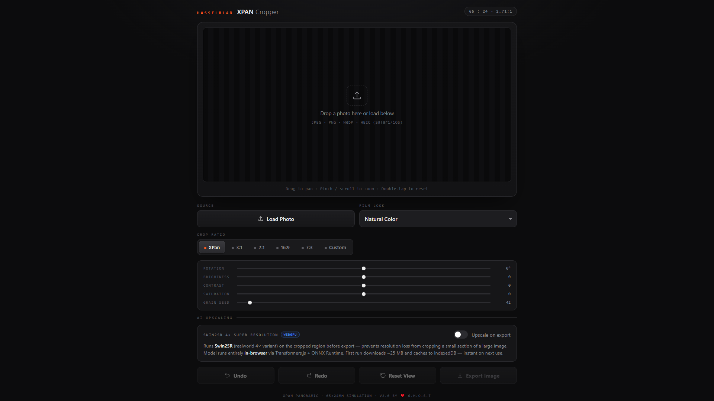
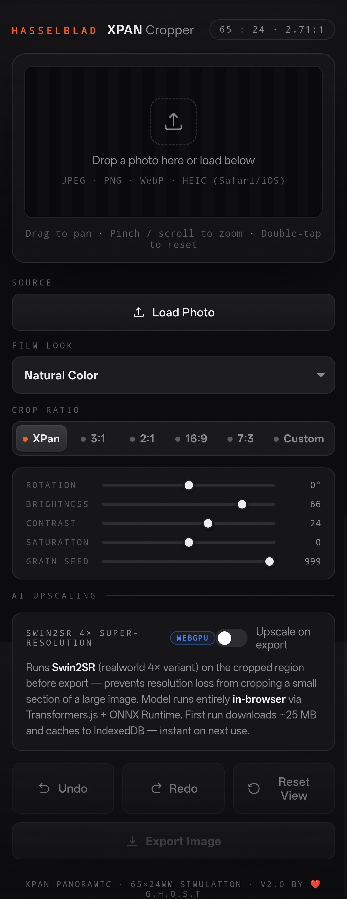

# XPAN Cropper

**A browser-based Hasselblad XPan panoramic crop tool with film emulation and AI upscaling.**  
Built by [G.H.O.S.T](https://github.com/im-ghost-dev) · Bangalore, India

---

## Screenshots

<table>
  <tr>
    <td align="center" width="60%">
      
      <sub>Desktop</sub>
    </td>
    <td align="center" width="40%">
      
      <sub>Mobile</sub>
    </td>
  </tr>
</table>

---

## What is this?

The [Hasselblad XPan](https://en.wikipedia.org/wiki/Hasselblad_XPan) was a cult panoramic film camera that exposed a **65×24mm frame** across two standard 35mm frames — producing an extreme **2.71:1 aspect ratio** that no digital camera natively shoots.

This tool lets you simulate that framing on any digital photo. Load an image, compose your panoramic frame, apply one of 27 hand-tuned film stock emulations (or skip the look entirely), and export a full-resolution JPEG — with optional AI upscaling so the tight crop never looks soft.

Everything runs **entirely in the browser**. No server-side processing, no upload. Single HTML file.

> **Important:** AI upscaling requires the page to be loaded over `http://` or `https://` (e.g. via GitHub Pages or a local dev server). It will not work if the file is opened directly from a file manager / Downloads folder (`content://` or `file://`), because the browser blocks cross-origin script execution from those origins. All other features (cropping, film looks, export) work fine from a local file.

---

## Live Demo

> **[im-ghost-dev.github.io/xpan-cropper](https://im-ghost-dev.github.io/xpan-cropper)**

---

## Features

### Core
- **XPan crop** — 65:24 (2.71:1) ratio, locked to the Hasselblad XPan standard
- **Horizontal / Vertical toggle** — flip orientation while keeping the 2.71:1 ratio
- **Pan & zoom** — drag to pan, scroll/pinch to zoom, double-tap/click to reset
- **Rotation** — ±45° slider with pan constraint recalculated on the rotated bounding box
- **Custom ratios** — presets for XPan / 3:1 / 2:1 / 16:9 / 7:3, plus free custom W:H input
- **Drag-and-drop** — drop a photo directly onto the canvas

### Film Emulation — 27 Stocks + Original
- **Original (No LUT)** — default option, skips film processing entirely, image stays untouched (adjustments still apply)
- All looks are per-channel tone curves (lift, gamma, contrast, colour cast) derived from published densitometry and spectral sensitivity data. Grain is **seeded** — same seed = identical noise every export.

| Group | Stocks |
|---|---|
| **Hasselblad** | Natural Color, XPan B&W |
| **Kodak Color** | Portra 400, Portra 160, Gold 200, UltraMax 400, Ektar 100, Ektachrome E100, Kodachrome 64 |
| **Kodak B&W** | Tri-X 400, T-MAX 100, T-MAX P3200 |
| **Fujifilm Color** | Provia 100F, Velvia 50, Velvia 100, Astia 100F, Superia 400, Pro 400H |
| **Fujifilm B&W** | Acros 100 II, Neopan 400 |
| **Ilford B&W** | HP5 Plus 400, Delta 3200, FP4 Plus 125, XP2 Super 400 |
| **Cinematic** | CineStill 800T (with halation), CineStill 50D, Vision3 500T |

### Adjustments
- Brightness / Contrast / Saturation sliders on top of (or instead of) film look
- Grain seed slider (0–999) for deterministic, repeatable exports

### Undo / Redo
- 50-step history — pan, zoom, rotation, all sliders, look changes, ratio changes, resets

### Haptic Feedback
- Light taps on button presses, ticks on slider release, success patterns on image load/export
- Android Chrome/Firefox only — iOS Safari does not support the Vibration API (Apple platform restriction), degrades silently

### AI Upscaling
- Runs **Swin2SR** (realworld 4×, full fp32 model) on the cropped region before export — prevents resolution loss from cropping a small section of a large image. Model runs entirely **in-browser** via Transformers.js + ONNX Runtime. First run downloads ~53 MB and caches to IndexedDB — instant on next use.

### Export
- Full native-resolution crop as JPEG (1.0 quality)
- Filename: `xpan_[stock]_seed[n]_[timestamp].jpg`

---

## Usage

1. Open the [live demo](https://im-ghost-dev.github.io/xpan-cropper) (or run locally — see below)
2. Drop a photo onto the canvas or use **Load Photo**
3. Pan, zoom, and rotate to compose your frame
4. Toggle horizontal/vertical orientation if needed
5. Pick a film stock (or leave on Original)
6. Adjust sliders as needed
7. Toggle **AI Upscaling** if you want 4× resolution on export
8. Hit **Export Image**

### Running locally
```bash
git clone https://github.com/im-ghost-dev/xpan-cropper.git
cd xpan-cropper
python -m http.server 8080
# open http://localhost:8080 in your browser
```

---

## Browser Support

| Browser | Film Looks | AI (WASM) | AI (WebGPU) | Haptics |
|---|---|---|---|---|
| Chrome 113+ (Android) | ✅ | ✅ | ✅ | ✅ |
| Edge 113+ | ✅ | ✅ | ✅ | ✅ |
| Firefox | ✅ | ✅ | ⚠️ Flag | ✅ |
| Safari 17+ (iOS) | ✅ | ✅ | ⚠️ Partial | ❌ Not supported |
| Mobile Chrome | ✅ | ✅ | Device-dependent | ✅ |

HEIC loads natively on **Safari / iOS** only.

---

## File Structure

```
xpan-cropper/
├── index.html                        ← entire tool, self-contained
├── README.md
├── LICENSE
└── docs/
    └── screenshots/
        ├── desktop-ui.png
        └── mobile-ui.jpg
```

---

## Notes

**Single file** — no build step, no dependencies, works from a USB drive or local double-click (except AI upscaling, see note above).

**Film stock disclaimer** — Kodak, Fuji, Hasselblad, and Ilford do not publicly release their proprietary LUT files. Emulations here are built from scratch using published spectral sensitivity data and community measurement projects (darktable, Filmulator, RawTherapee).

**AI model** — Runs Swin2SR (realworld 4×, full fp32 model) on the cropped region before export.

---

## License

[MIT](LICENSE) — do whatever you want with it, attribution appreciated.
